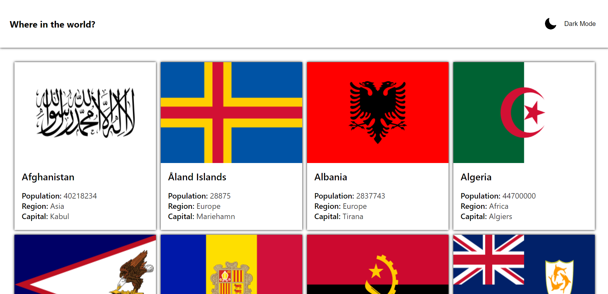

# "Where in the world"

### Netlify :- https://reliable-unicorn-f6ba80.netlify.app/

## Table of contents

  - [Overview](#overview)
    - [The Task](#the-task)
    - [Screenshots](#screenshots)
  - [My Process](#my-process)
    - [Built With](#built-with)
    - [APIs Used](#apis-used)
  - [Author](#author)

## Overview

### The Task

Users should be able to :

- View a brief description of countries in cards
- Click and view details
- Toggle between dark mode and light mode

### Screenshots

## My Process

### Built With

  - ReactJS
  - CSS

### APIs Used

  - [Rest Country API](https://restcountries.com/v2/all)

## Author

- Frontend Mentor - [@Gauravtripathii](https://www.frontendmentor.io/profile/Gauravtripathii)
- Instagram - [@gauravtripathii](https://www.instagram.com/gauravtripathii/)
- LinkedInn - [Gaurav Kumar Tripathi](https://www.linkedin.com/in/gaurav-kumar-tripathii/)
